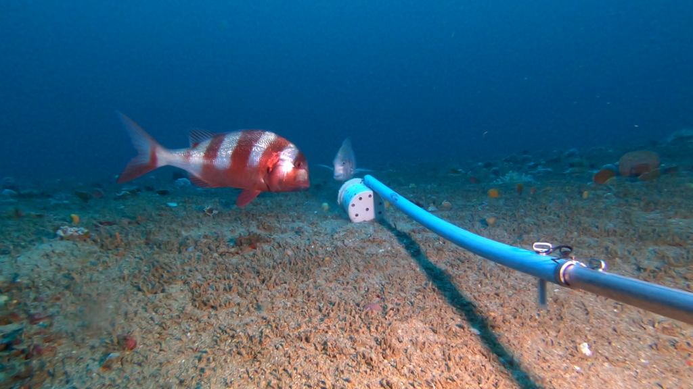
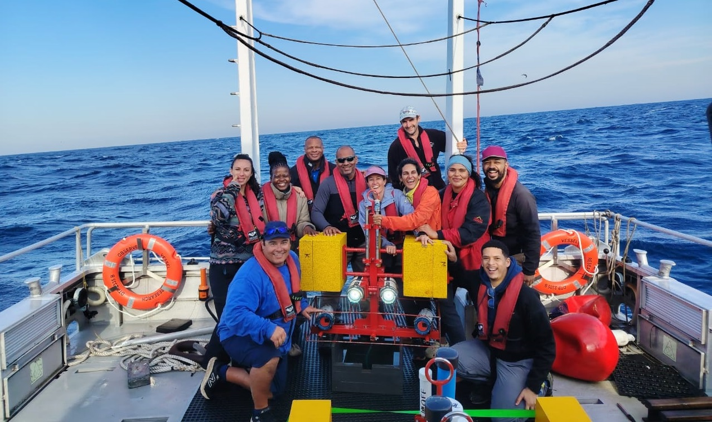
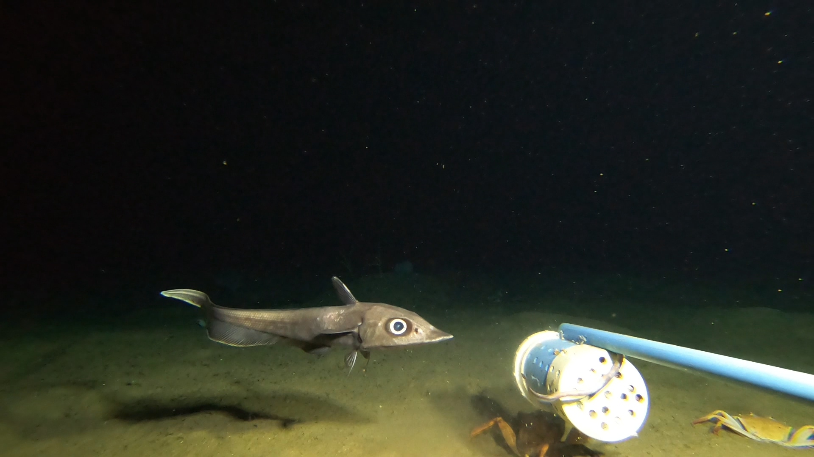
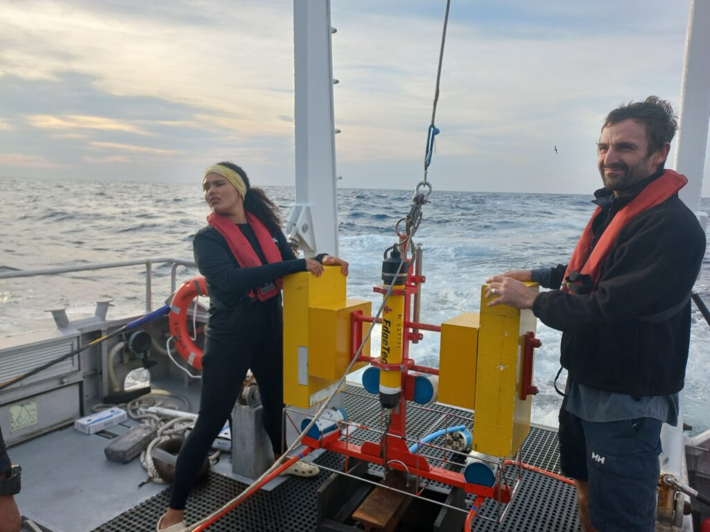
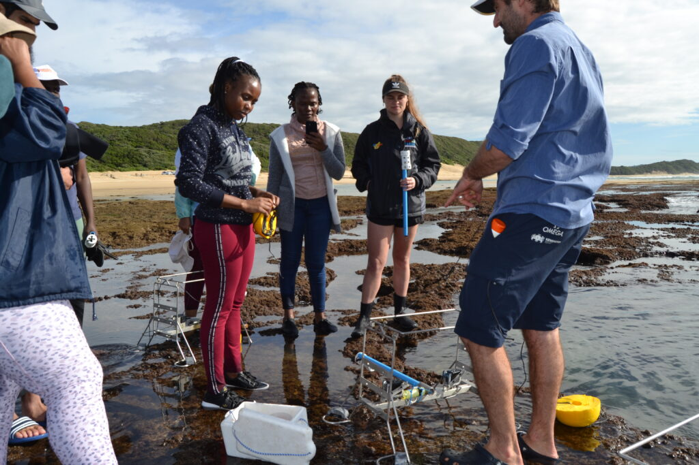
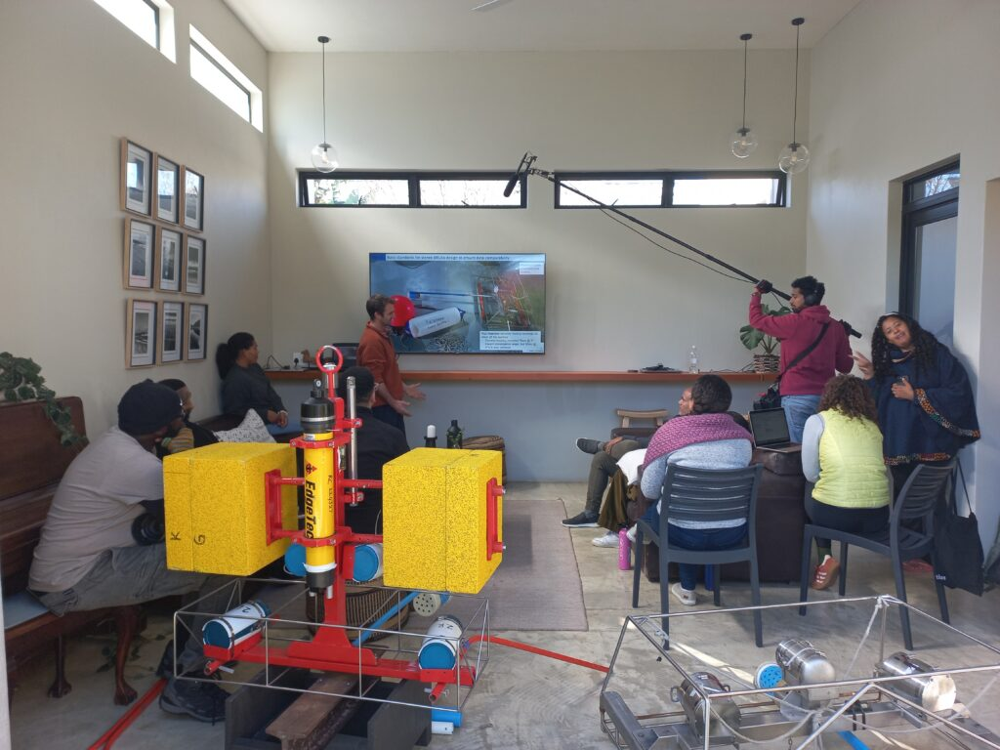

<a href="https://nrf-saiab-marip.github.io/">Home</a> - 
<a href="https://saiab.ac.za/platforms/marine-remote-imagery-platform-mar-ip/" target="_blank">About</a> -
<a href="https://nrf-saiab-marip.github.io/SOPs-Resources/">SOPs & Resources</a> - 
<a href="https://nrf-saiab-marip.github.io/SOPs-Resources/">Downloads</a> - 
<a href="mailto:atf.bernard@saiab.nrf.ac.za?cc=e.heyns-veale@saiab.nrf.ac.za,a.vanwyk@saiab.nrf.ac.za&subject=MARIP%20Website%20Inquiry">Contact</a>

***

[View SA BRUVs Network Map](assets/docs/26-02_sa_bruvs_network_map.html)

<b>The Marine Remote Imagery Platform (MaRIP)</b> is Africa's largest and most comprehensive underwater visual research platform, hosted at the South African Institute for Aquatic Biodiversity (NRF-SAIAB). MaRIP gives scientists the ability to conduct ecological research across South Africa's continental shelf and into the deep sea, from the shallow subtidal to depths exceeding 1000 m.

The platform supports data collection on demersal and benthic fish populations, as well as sessile and mobile invertebrate species, using a range of underwater camera systems including baited remote underwater stereo-video systems (BRUVs), remotely operated vehicles (ROVs), diver-operated cameras, drop cameras, and deep-water baited landers.

# Research Focus

MaRIP's primary research focus is the ecology and population structure of fish and invertebrate communities across South Africa's shelf and slope environments. BRUVs data is used to monitor demersal fish that are heavily targeted by recreational and commercial fisheries, assess the effectiveness of Marine Protected Areas, and provide scientific evidence for fisheries regulations and policy. The platform also contributes to national habitat mapping initiatives, with data feeding into South Africa's marine ecosystem type classification - a foundational layer for ocean space management and Blue Economy planning.

  
  
  

# Training & Capacity Development

Training is central to MaRIP's mandate. The platform has supported over 100 students and researchers from 39 institutions across South Africa and internationally, and runs an annual Summer School for emerging marine scientists. The platform regularly hosts workshops and training events that bring together researchers and managers from across the region to standardise methods and strengthen the contribution of visual survey data to marine management and policy.

  
  
  

# Working Group Resources

This site hosts the SOPs, data management guidelines, and template folder systems used across MaRIP projects. If you are being onboarded or setting up a project, start with the SOPs & Resources page.

# Funders & Partners
MaRIP is funded by DSTI, NRF-SAIAB, and SMCRI.

  

(<a href="#readme-top">back to top</a>)

